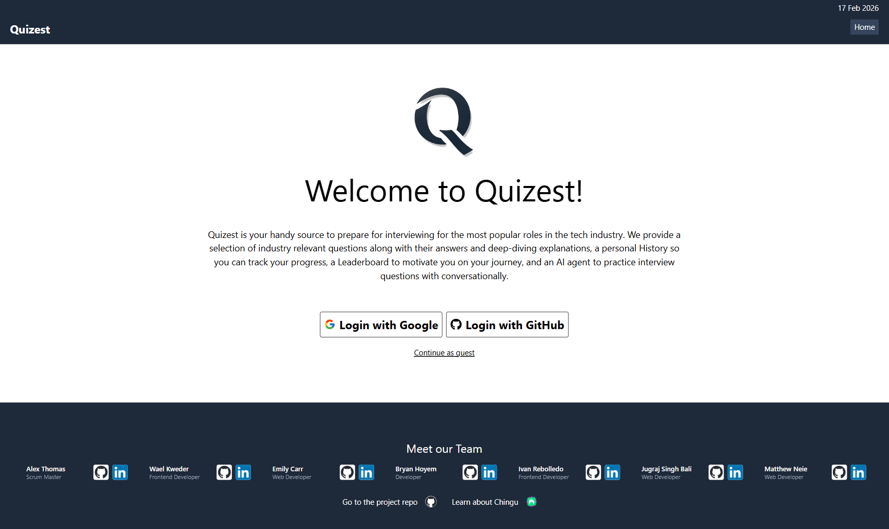

# Quizest

# 💻 Overview

***Quizest*** is an app built with React and TypeScript that helps aspiring job seekers in the tech industry prepare for job interviews
and potential certifications. It provides a user with basic questions that might be encountered and provides a quiz-style format to 
answer questions with a score afterwards for self-evaluation. It also allows a user to compare their scores to other users of the platform 
as well as see their overall history.

# 📲 Features

***Quizest*** includes the following features:

- **Authenticated Login:** Users are able to log in using either their Google account or their GitHub account and track their results and history.
- **Multiple-Choice Quiz Questions:** Users can begin with a basic set of questions to answer and answers are supported with amplifying information to ensure understanding.
- **Additional Questions On Request:** Users are able to grow their library of quiz questions by selecting to re-try quizes with new additional questions. ***Quizest*** uses Gemini Flash AI to generate additional questions for the selected role and tracks them with the accumuluated results.
- **Open Ended Questions:** Users are also able to practice answering some common open ended interview questions and be provided feedback generated through Gemini Flash AI.
- **Result history and Leaderboards:** Users can see their history of scores to track improvements and progression as well as compare their scores or quiz history to other users for competitive motivation if desired.

#  🧰  Tech Stack

- React
- TypeScript
- Tailwind CSS
- React Router
- Vite
- Supabase
- Google Gemini Flash API
- Netlify

#  🌐 App Experience

***Quizest*** is deployed via Netlify here: [Quizest](https://quizestmain.netlify.app/)

The repository is also available in GitHub here: [GitHub](https://github.com/chingu-voyages/V59-tier2-team-23)

# ▶️ Running The Project

Follow these steps within your command line interface (CLI) to run ***Quizest*** on your local machine:

1. **Clone the repository** to your local system using:
   `https://github.com/chingu-voyages/V59-tier2-team-23.git` 
   
2. **Navigate into the newly created project directory** using: `cd V59-tier2-team-23`

3. **Install the project's dependencies** to ensure it runs smoothly: `npm install`

4. **Start the development server**, launching the application in development mode with Vite using: `npm run dev`
   - This starts a local development server. Open [http://localhost:5173](http://localhost:5173) in your browser to view the app.

8. **Environment variables (.env setup)**  
   To run **Quizest** locally, you’ll need a `.env` file in the project’s root folder with your own keys.

   - **Create the `.env` file**
     - In the root of the project (same level as `package.json`), create a new file named `.env`.
     - Make sure the file name is exactly: `.env` (no extension).

   - **Add your Supabase credentials**
     - Sign up or log in at Supabase and create a new project.
     - In the Supabase dashboard, go to **Project Settings → API**.
     - Copy the **Project URL** and **anon public key**, then add them to `.env`:
       - `VITE_SUPABASE_URL='your-supabase-project-url'`
       - `VITE_SUPABASE_ANON_KEY='your-supabase-anon-public-key'`

   - **Add your Google Gemini API key**
     - Go to Google AI Studio and create or view an API key.
     - Copy the key and add it to `.env`:
       - `VITE_GEMINI_API_KEY='your-gemini-api-key'`

   - **Important**
     - Keep `.env` private and **do not commit it** to GitHub.
     - After creating or updating `.env`, restart your dev server if it’s already running.

# 👥 Our Team

### Scrum Master: 
- Alex Thomas - [GitHub](https://github.com/BagelTime) / [LinkedIn](https://linkedin.com/in/ajt11176)

### Web Developers:
- Wael Kweder - [GitHub](https://github.com/WDataW) / [LinkedIn](https://linkedin.com/in/wael-kweder-a63836339/)
- Emily Carr - [GitHub](https://github.com/codingEmily) / [LinkedIn](https://www.linkedin.com/in/emily-c-2285a9277/)
- Bryan Hoyem - [GitHub](https://github.com/bhoyem) / [LinkedIn](https://www.linkedin.com/in/bryanhoyem)
- Ivan Rebolledo - [GitHub](https://github.com/ivannissimrch) / [LinkedIn](https://www.linkedin.com/in/ivan-rebolledo-012b17244/)
- Matthew Neie - [GitHub](https://github.com/MatthewNeie) / [LinkedIn](https://www.linkedin.com/in/matthew-neie)
- Jugraj Singh Bali - [GitHub](https://github.com/jugrajsinghbali) / [LinkedIn](https://www.linkedin.com/in/jugraj-singh-bali-117994268/)
